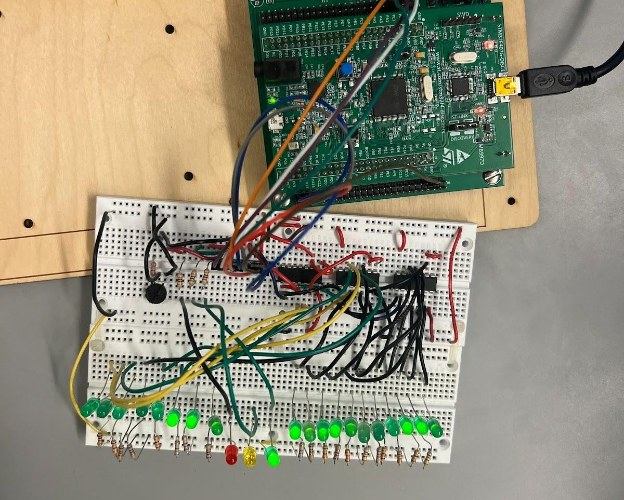

# Traffic Light System

A FreeRTOS simulation of a single-lane road with one traffic light, running on an STM32F4 Discovery board.

## How it works

- **Road:** 19 green LEDs are the road, and each lit LED is a car. Cars move one LED every 500 ms and stop at the stop line when the light is red or yellow. Cars that are already past the intersection keep going.
- **Traffic flow:** a potentiometer on the ADC sets the flow. More flow means cars are more likely to spawn and the green light stays on longer:
  - Green: 5 to 10 s
  - Red: 10 to 5 s
  - Yellow: always 2 s
- **Shift registers:** three daisy-chained SN74HC164 shift registers drive the car LEDs. They're bit-banged over GPIO (data on PC6, clock on PC7, clear on PC8).

## Architecture

**Tasks:**

| Task | Priority | Job |
|---|---|---|
| `TrafficFlowTask` | 2 | Reads the potentiometer every 100 ms and publishes a flow rate from 0 to 100% |
| `TrafficLightTask` | 3 | Starts the light timer chain and adjusts the green and red durations to the flow |
| `TrafficGeneratorTask` | 2 | Spawns a car each tick with a probability that rises with the flow |
| `SystemDisplayTask` | 1 | Moves the cars and updates the LEDs every 500 ms |

**Queues:**

| Queue | Pattern |
|---|---|
| `FlowRate` | Length 1, overwrite and peek |
| `LightState` | Length 1, overwrite and peek |
| `NewCar` | Length 10, FIFO |

**Timers:** three one-shot timers (green, yellow, red). Each timer's callback starts the next one.

All communication between tasks goes through queues, with no shared global data. Car spawning uses a small xorshift32 random number generator seeded from ADC noise.
